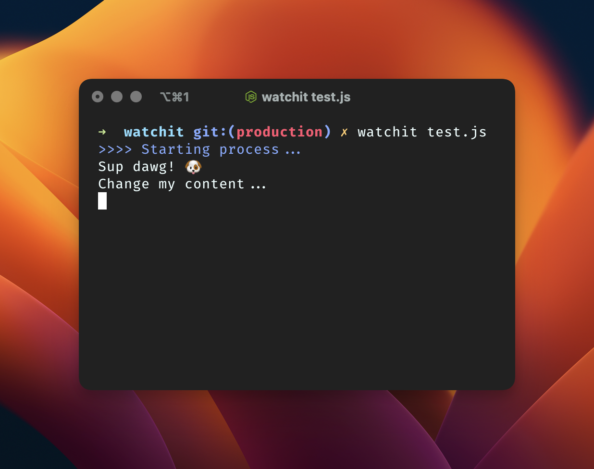

# File watcher

```shell
# By default it will search for index.js
watchit
# Optionally pass in a filename/path to watch
watchit test.js
```

Note: Run `npm link` to get this to work locally. Don't run `watchit` on this `index.js` as it will cause an endless loop.


